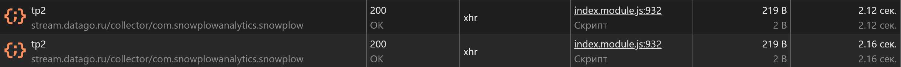

# Анализ открытия страницы в Chrome DevTools

Сделать в Chrome DevTools анализ открытия страницы <https://www.rigla.ru>. Открывать Chrome в режиме инкогнито. Использовать вкладки Network, Performance, Coverage.

## Содержание

- [Подготовка](#подготовка)
- [Network](#network)
- [Performance](#performance)
- [Coverage](#coverage)

## Подготовка

- Использовать URL <https://www.rigla.ru>
- Открывать URL в режиме инкогнито <https://support.google.com/chrome/answer/95464> с отключенными расширениями браузера, чтобы они не искажали результаты
- На вкладке Network отключить кэш (Disable cache) — это эмулирует первый заход пользователя на страницу, когда у него пустой кэш
- Включить замедление CPU 4x slowdown и эмуляцию сети Slow 3G

## Network

[Вернуться к содержанию](#содержание)

### Описание Network

1. [Записать и сохранить в HAR архив профиль загрузки ресурсов при открытии страницы](./Network/www.rigla.ru.har)
2. Найти неоптимальные места:
   - [Дублирование ресурсов](#дублирование-ресурсов)
   - [Лишний размер ресурса](#лишний-размер-ресурса)
   - [Медленно загружающиеся ресурсы](#медленно-загружающиеся-ресурсы)
   - [Ресурсы, блокирующие загрузку](#ресурсы-блокирующие-загрузку)
3. При описании найденных неоптимальных мест делать скриншот соответствующего участка панели Network, чтобы было понятно, что именно имеется в виду

#### Дублирование ресурсов

#### Лишний размер ресурса

Неоптимизированные изображения

#### Медленно загружающиеся ресурсы

#### Ресурсы, блокирующие загрузку

## Performance

[Вернуться к содержанию](#содержание)

### Описание Performance

1. [Записать и сохранить в файл профиль загрузки страницы](./Performance/Trace-20240621T200414.json)
2. Измерить время в миллисекундах от начала навигации до событий:
   - [First Paint (FP)](#first-paint)
   - [First Contentful Paint (FCP)](#first-contentful-paint)
   - [Largest Contentful Paint (LCP)](#largest-contentful-paint)
   - [DOM Content Loaded (DCL)](#dom-content-loaded)
   - [Load](#load)
3. [Определить, на каком DOM-элементе происходит LCP](#dom-элемент-lcp)
4. [Измерить, сколько времени в миллисекундах тратится на разные этапы обработки документа (Loading, Scripting, Rendering, Painting)](#время-на-разные-этапы-обработки-документа)

#### First Paint

Временная метка 18601.5 мс

#### First Contentful Paint

Временная метка 18601.5 мс

#### Largest Contentful Paint

Временная метка 31918.5 мс

#### DOM Content Loaded

Временная метка 5305.6 мс

#### Load

Временная метка 68500.4 мс

#### DOM-элемент LCP

#### Время на разные этапы обработки документа

## Coverage

[Вернуться к содержанию](#содержание)

### Описание Coverage

1. [Сохранить скриншот вкладки после загрузки страницы](#скриншот-coverage)
2. [Измерить в килобайтах объём неиспользованного CSS в ходе загрузки страницы](#объём-неиспользованного-css)
3. [Измерить в килобайтах объём неиспользованного JS в ходе загрузки страницы](#объём-неиспользованного-js)

#### Скриншот Coverage

#### Объём неиспользованного CSS

~45,4 Кб

#### Объём неиспользованного JS

~3600 Кб

